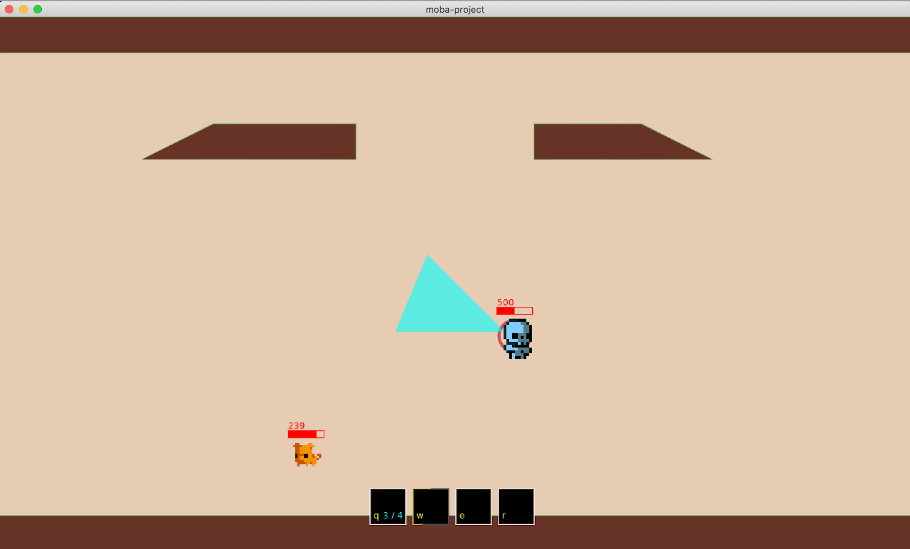

# moba-project

A 2D multiplayer online battle arena



## building
* install [love2d](https://love2d.org/#download)
* alias `love`
  ```
  alias love="/Applications/love.app/Contents/MacOS/love"
  ```
* run the game
  ```
  love .
  ```

## TODOs

#### Mechanics

* auto attacks

* gold/resources

* player death

* collision

* ability targeting

* ~~terrain~~

* ~~damage~~

* ~~movement~~

* ~~minion death~~

#### UI

* minimap

* damage indicators

* HUD (health, resources)

* player inventory

* tooltips

* ~~health indicators~~

* ~~ability cooldown indicators~~

## refactors

* client/server

* ~~viewport/camera~~

## Bugs

* movement and ability targeting is not honoring pythagoras
  * characters move faster in cardinal directions than diagonally
  * abilities are longer when facing cardinal directions
