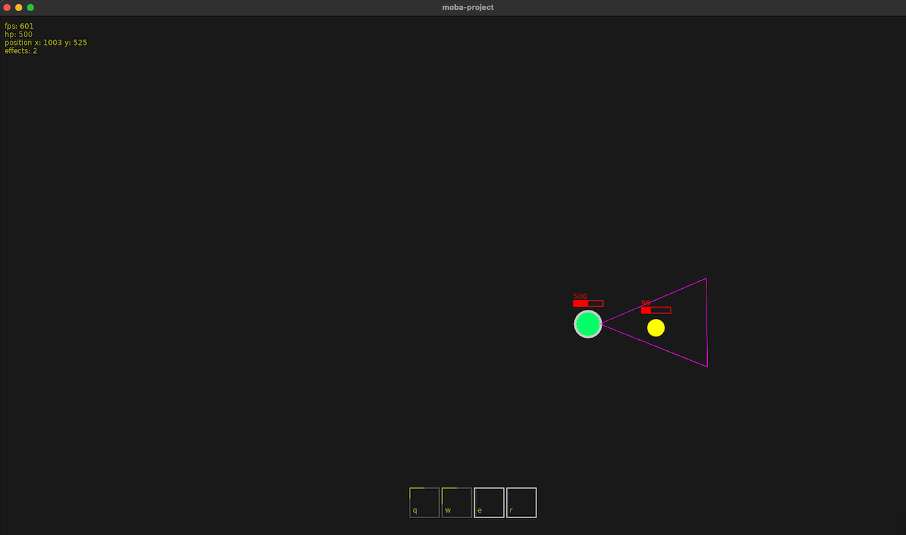

# moba-project



## building
* install [love2d](https://love2d.org/#download)
* alias `love`
  ```
  alias love="/Applications/love.app/Contents/MacOS/love"
  ```
* run the game
  ```
  love .
  ```

# TODOs

## Mechanics

* auto attacks

* terrain

* gold/resources

* player death

* collision

* ability targeting

* ~~damage~~

* ~~movement~~

* ~~minion death~~

## UI

* minimap

* damage indicators

* HUD (health, resources)

* player inventory

* tooltips

* ~~health indicators~~

* ~~ability cooldown indicators~~

# refactors

* client/server

* viewport/camera
